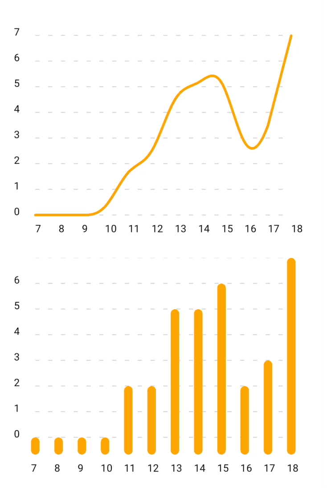

# react-native-skia-charts

**High-performance charts for react-native** 🚀  
[](https://www.npmjs.com/package/react-native-skia-charts)

### This library is under development and is not ready for production use. Yet.

# Example

<div>
  
</div>

Clone the repo and run one of the following commands to run the example app:

```js
npm run example:ios
```

or

```js
npm run example:android
```

## Installation

<pre>
npm install <a href="https://github.com/d3/d3-scale">d3-scale</a>
npm install <a href="https://github.com/software-mansion/react-native-reanimated">react-native-reanimated</a>
npm install <a href="https://github.com/software-mansion/react-native-gesture-handler">react-native-gesture-handler</a>
npm install <a href="https://github.com/Shopify/react-native-skia">@shopify/react-native-skia</a>
npm install react-native-skia-charts
</pre>

## Usage

```jsx
import { LineChart, StackedBarChart } from 'react-native-skia-charts';
// ...
<LineChart
  datasets={[{
    label: 'Default line',
    color: '#DE5C9D',
    data: [
      {
        x: '2020-01-02',
        y: 10,
      },
      {
        x: '2020-01-03',
        y: 20,
      },
      ...
    ],
  }]}
  fontFile={require("../assets/fonts/Roboto-Regular.ttf")}
/>

```

## Configuration props

### `datasets` (required)

The data to be displayed in the chart. The data should be an array of objects with a `date` and `value` properties.

### `fontFile` (required)

A font file to be used in the chart. Example: `require("../assets/fonts/Roboto-Regular.ttf")`

### `startDate`

If not provided, `startDate` will be calculated from `data` prop.

### `endDate`

If not provided, `endDate` will be calculated from `data` prop.

### `onTouchStart`

### `onTouchEnd`

### `fontSize`

### `chartColor`

### `yAxisMax`

### `tension`

### `labelsColor`

### `paddingVertical`

### `paddingHorizontal`

### `tooltip`

### `borderRadius`

## Chart types

- Line chart (draft state)
- Tooltip (todo)
- Bar chart (draft state)
- Stacked Bar chart (todo)
- Multiple lines chart (todo)
- Donut chart (todo)

## Contributing

See the [contributing guide](CONTRIBUTING.md) to learn how to contribute to the repository and the development workflow.

## License

MIT

### Contact me

ryabinin.dev@gmail.com

---

Made with [create-react-native-library](https://github.com/callstack/react-native-builder-bob)
