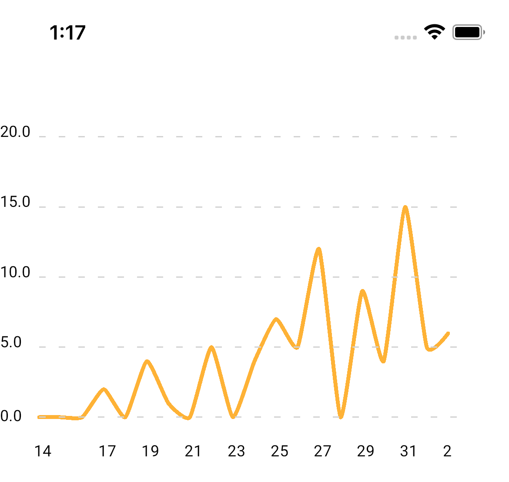

# react-native-skia-charts

**High-performance charts for react-native** 🚀  
[](https://www.npmjs.com/package/react-native-skia-charts)

### This library is under development and is not ready for production use. Yet.

# Example



Clone this repo and run the following command to run the example app:

```js
npm run bootstrap:ios // for ios
npm run bootstrap:android // for android
```

## Installation

<pre>
npm install <a href="https://github.com/d3/d3-scale">d3-scale</a>
npm install <a href="https://github.com/d3/d3-shape">d3-shape</a>
npm install <a href="https://github.com/iamkun/dayjs">dayjs</a>
npm install <a href="https://github.com/software-mansion/react-native-reanimated">react-native-reanimated</a>
npm install <a href="https://github.com/software-mansion/react-native-gesture-handler">react-native-gesture-handler</a>
npm install <a href="https://github.com/Shopify/react-native-skia">@shopify/react-native-skia</a>
npm install react-native-skia-charts
</pre>

## Configuration props

### `startDate`
Optional prop. If not provided, `startDate` will be calculated from `data` prop.

### `endDate`
Optional prop. If not provided, `endDate` will be calculated from `data` prop.

## Chart types

- Line chart (in progress)
- Tooltip (in progress)
- Stacked Bar chart (todo)
- Multiple lines chart (todo)
- Bar chart (todo)
- Donut chart (todo)

## Contributing

See the [contributing guide](CONTRIBUTING.md) to learn how to contribute to the repository and the development workflow.

## License

MIT

### Contac me
ryabinin.dev@gmail.com

---

Made with [create-react-native-library](https://github.com/callstack/react-native-builder-bob)
